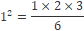
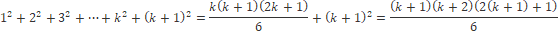

영상: https://www.youtube.com/playlist?list=PLD8rdlfZeJk7ijUM8ckwLLNyDKRD2aQa2

### [명제와 연산자](이산-수학/이산수학-기초/명제와-연산자.md)

### 추론,연역법과 귀납법

#### 추론P

- 이미 참으로 알고있는 명제들로부터 새로운 참인 명제를 찾는 과정
- 추론의 타당성
  - P*1*, P*2*,, P*3*, ... , P*n*이 True이고 여기서 도출된 결론 Q는 True라고 주장한다면, 이 추론은 타당한가?

#### 연역법

| p → q(전제) | p(전제) | q(결론) |
| ----------- | ------- | ------- |
| T           | T       | T       |

##### 예시

> All men is mortal. (전제)
>
> Socrates is a man. (전제)
>
> Threfore, Socrates is mortal. (결론)

> 모든 컴퓨터 공학과 학생들은 C언어를 수강한다. (전제)
>
> 김철수는 컴퓨터 공학과 학생이다. (전제)
>
> 그러므로 김철수는 C언어를 수강한다. (결론)

> 모든 농구 선수들은 키가 크다. (전제)
>
> 김철수는 농구 선수이다. (전제)
>
> 그러므로 김철수는 키가 크다. (결론)

##### 수학과 연역법

- 수학의 이론은 연역법에 의해 만들어진 명제들로 이루어 진다.
- 전제 : Axiom(공리, 가정), definition(정의), theorem(이미 증명된 정리)
- 결론: conclusion(정리, Lemma)

#### 귀납법

- 개별적인 사실을 말하는 명제들로부터 일반적인 결론을 도출하는 방법

##### 예시

> 김철수, 이영희, 홍복동은 컴퓨터 공학과 학생이다.
>
> 김철수는 C언어를 수강한다.
>
> 이영희는 C언어를 수강한다.
>
> 홍복동은 C언어를 수강한다.
>
> 따라서 모든 컴퓨터 공학과 학생들은 C언어를 수강한다.

##### 귀납법의 한계

- 현실적으로 집합의 모든 원소에 대해서 참인 것을 밝힐 수 없다.
- 따라서 도출된 결론은 확률적인 결론

### 수학적 귀납법
- 귀납법의 한계를 극복
- 집합의 모든 원소에 대해서 명제가 성립하는 것을 보여준다.
- 따라서 모든 경우에 명제가 성립하는 것을 증명

#### 수학적 귀납법의 구조

> 집합 X = {x*1*, x*2*, x*3*, ... , x*n*},  n은 자연수
>
> ∀ x P(x)는 True
>
> 1. n = 1
>
>    P(x*1*)은 True임을 보인다.
>
> 2. n = k (k > 1)
>
>    P(x*k*)가 True라고 가정한다.
>
> 3. n = k + 1
>
>    P(x*k + 1*)이 True임을 보인다.
>
> 그렇다면 ∀x P(x)에 대해서 True

#### 예시

>

1. n = 1일 때

2. n = k일 때 성립한다고 가정

3. n = k + 1일 때

 주어진 식은 n = k + 1일 때도 성립한다.
 따라서 주어진 식은 ∀ n ∈ N에 대하여 성립한다.

> 

1. n = 1일 때
   
   
   
2. n = k일 때 성립한다고 가정

   

1. n = k + 1일 때

   

   주어진 식은 n = k + 1일 때도 성립한다.
   따라서 주어진 식은 ∀ n ∈ N에 대하여 성립한다.

### [부울 대수(Boolean Algebra)](/이산-수학/명제,추론,귀납,부울대수/부울-대수.md)

### 논리회로 설계

- 