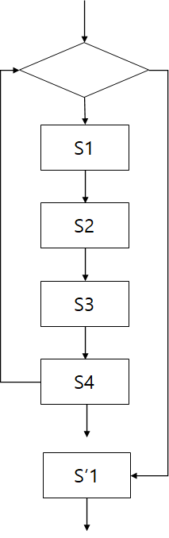
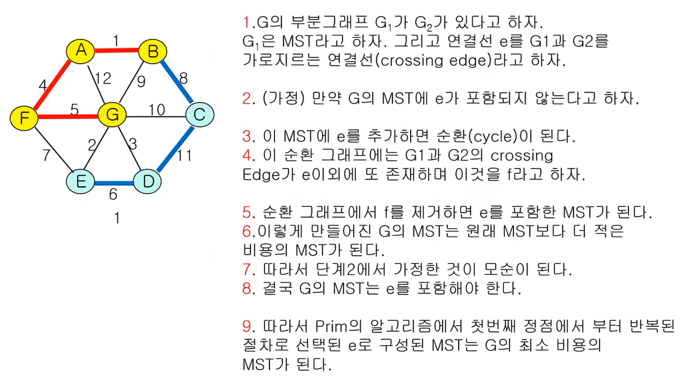

영상: https://www.youtube.com/playlist?list=PLD8rdlfZeJk6evHY9NsnBqXKrreNbTqFv

### 알고리즘

> - 문제를 해결하기 위한 절차를 기술한 것
> - 누구나 정해진 절차대로 실행할 수 있어야 한다.
> - 누구나 동일한 입력값이 주어지면 이 절차대로 실행하면 동일한 출려값을 얻을 수 있어야 한다.
> - 일정한 시간안에 출력값을 구할 수 있어야 한다.

- 순서대로 정의된 절차
  - 문명한 순서가 있어야 한다.
  - 한 동작을 실행하면 다음에 실행할 동작이 무엇인지 분명 해야 한다.
- 명확성
  - 모든 동작은 명확하게 정의되어야 한다.
  - 모든 동작은 실행 가능해야 한다.
- 반드시 원하는 결과가 나와야 한다.
- 일정한 시간 안에 실행되어야 한다.


#### 구조

1. 순차적 구조(sequential structure)

   

2. 분기 구조(branch)

   

3. 반복 구조(retetition)

   

4. 점프 구조(jump)

   


#### 기술 방법

1. 플로우차트(flowchart)
2. 프로그램 언어의 코드
   - 이것은 특정 프로그램 언어의 문법을 알아야 된다.
   - 또 코드 수준으로 자세히 적을 필요는 없다.
3. Pseudocode
   - 프로그램 언어의 코드 전 단계로 프로그램 언어들이 사용하는 구조를 그대로 이용한다.


#### 예시

> 이진 탐색
>
> 리스트트의 키 값이 정렬되어 있다면 순차 검색 보다 빠른 시간 안에 검색할 수 있다.
>
> [1, 3, 4, 5, 10, 13, 15, 20, 23, 32]

1. 언어로 기술하기

   먼저 찾고자 하는 키 값을 리스트의 중간에 위치한 값, 13과 비교한다. 만약 찾고자 하는 키 값이 13 보다 작으면 이 값은 13보다 왼쪽에 위치하고 있으며, 13보다 크다면 13의 오른쪽에 위치하고 있다. 따라서 다음 단계에서 13보다 왼쪽에 있는 값들, 혹은 오른쪽에 있는 값들을 가지고 같은 절차를 반복한다.

2. 알고리즘

   ```pseudocode
   while (리스트 구간의 크기 > 0)
   	구간의 중간값을 구한다.
   	if (구간의 중간값 = 키값)
   		탐색 종료
   	else if (구간의 중간값 > 키값)
   		오른쪽 구간 선택
   	else
   		왼쪽 구간 선택
   ```

3. Pseudocode

   ```pseudocode
   get Target, n and [N1, N2, ..., Nn]
   begin = 1
   end = n
   Found = NO
   while (Found = NO and begin <= end)
   	m = (begin + end) / 2
   	if (target = Nm)
   		print Nm
   		Found = YES
   	else
   		if (target < Nm)
   			end = m - 1
   		else
   			begin = m + 1
   if (Found = NO)
   	print "can't find target"
   stop
   ```

   

### 오일러 순환과 해밀턴 순환

#### 오일러 순환

- 오일러 경로(Eulerian path) : 그래프 G의 모든 연결선을 한번만 방문하는 경로
- 오일러 순환(Eulerian cycle 혹은 Circuit) : 시작점과 끝점이 동일한 오일러 경로
- 오일러 그래프 : 오일러 순환이 존재하는 그래프


#### 차수(degree)

- 정점 u에 접합된 연결선의 수
- 차수는 deg(u)와 같이 표기하기도 한다.


#### 오일러 경로를 갖기 위한 필요 충분 조건

> 2개 이상의 정점을 갖는 루프가 없는 연결 그래프에서 홀수 차수(odd degree)를 갖는 정점이 하나도 없거나 오직 두 개만 존재해야 한다.
>
> 특히 모든 정점이 짝수 차수를 가지면 오일러 순환이 존재하며, 이 그래프는 오일러 그래프이다.


#### 해밀턴 순환

- 해밀턴 경로(Hamiltonian path): 그래프 G에서 모든 정점을 정확히 한 번만 지는 경로
- 해밀턴 순환(Hamiltonian cycle 혹은 circuit) : 시작점과 끝점이 같은 해밀턴 경로


#### 해밀턴 순환을 찾는 알고리즘


####  

#### 해밀턴 순환 알고리즘

- Exhaustive Search
- 탐색해야 되는 경로의 수
  - 트리의 leaf의 수
- 트리의 높이 : n + 1
- Leaf의 수 : 2<sup>n</sup>


#### 해밀턴 순환 찾는 알고리즘 복잡도

- 알고리즘 복잡도 : O(X<sup>n</sup>) (n : 정점의 수)
- 복잡도 함수는 다항식이 아니라 지수식이다.
- 몹시 어려운 문제
- 유사한 복잡도 문제
  - 암호 해독
  - 바둑(혹은, 장기, Chess 등)
  - Bin packing 등


#### 방문 판매원 문제(Traveling Salesman Problem)

- 연결선에는 비용이 주어진다. (weighted edge)
- 일반적으로 완전 그래프
- 이 그래프에서 비용이 최소가 되는 해밀턴 순환을 찾는 문제


#### TSP 알고리즘1

모든 해밀턴 순환을 찾아서 합한 비용이 가장 작은 순환을 선택한다. :arrow_right: Exhaustive search


#### TSP 알고리즘2

> 단순 TSP 알고리즘
>
> 1. 하나의 정점을 선택하여 출발점으로 한다.
> 2. 이 정점에 연결된 연결선의 비용이 가장 작은 정점을 선택한다.
> 3. 이 정점에서부터 아직 선택되지 않은 정점들 중에서 연결선의 비용이 가장 작은 정점을 선택한다.
> 4. 모든 정점을 선택할 때 까지 2와 3의 절차를 반복한다.


### 기본 용어

#### 그래프(graph)

> 그래프 G는 다음의 두 가지 집합으로 구성되며 G = {V, E}로 표시한다. 여기서 V는 정점(vertex)들의 집합이며, E는 정점들을 연결하는 선(edge)들의 집합이다.


- 임의의 연결선 e=(u, v)에 대해서 정점 u와 v는 서로 인접(adjacent)했다고 하며, e는 정점 u와 정점 v에 접합(incident)한다고 말한다.

- 연결선의 두 끝점이 같은 정점이면 이 연결선을 루프(loop)라고 한다. 두 정점의 연결선이 두 개 이상일 때 다중 연결선이라고 한다.

- 단순 그래프(simple graph) : 루프나 다중 연결선이 없는 그래프

- 정점 u에 접합된 연결선의 수를 정점 u의 차수(degree)라고 한다. 차수는 deg(u)와 같이 표시한다.

  

- 그래프에서 모든 정점의 차수의 합은 모든 연결선 수의 2배이다.

- 두 정점 u와 v 사이에 연결선이 존재하면 두 정점은 연결(connected)되었다고 한다.

- 길이(length) : 두 정점의 경로를 구성하는 연결선의 수

- 거리(distance) : 두 정점 간의 최단 경로의 길이

- 닫힌 경로(closed path) : 만약 경로 {v, v<sub>2</sub>,  ... , v<sub>n</sub>}에서 v<sub>1</sub> = v<sub>n</sub>인 경로

- 순환(cycle 혹은 circuit) : 3개 이상의 연결선을 갖는 경로에서 어떤 연결선도 중복되지 않는 닫힌 경로(closed path)


##### 부분 그래프(subgraph) 

그래프 G={V, E}가 있을 때, V'⊆V이고 E'⊆E인 그래프 G' = {V', E'}를 G의 부분 그래프라고 한다.


##### 동형 그래프(isomorphic graph)

임의의 두 그래프 G={V, E}와 G'={V', E'}에 대하여 다음의 조건을 만족하는 함수가 1:1 관계의 함수이면 두 그래프 G와 G'를 동형 그래프라고 한다.


그리고 이 관계가 성립하는 함수 f를 동형(isomophic)이라고 한다.


##### 완전 그래프(complete graph)

그래프 G={V, E}가 모든 정점 사이에 연결선이 존재하면 G를 완전 그래프라고 한다. 완전 그래프는 K<sub>m</sub>으로 표시한다. (m은 정점의 총 수)


##### 이분 그래프(bipartite graph)

그래프 G={V, E}의 V가 X∩Y=Ø인 두 부분 집합 X와 Y로 갈라지고, 연결선이 x∈X, y∈Y인 (x, y)의 쌍으로 이루어지면 G는 이분 그래프라고 한다. 또한 X의 모든 정점과 Y의 모든 정점 사이에 연결선이 존재하면 G를 완전 이분 그래프(complete bipartite graph)라고 하며 K<sub>m, n </sub>으로 표시한다. (m은 X의 개수, n은 Y의 개수)


##### 정규 그래프(reqular graph)

 그래프 G={V, E}의 모든 정점의 차수가 같으면, G를 정규 그래프라고 한다.


##### 평면 그래프(planar graph)

그래프 G=(V, E)의 연결선들이 서로 교차하지 않고 평면상에 그릴 수 있는 그래프G를 평면 그래프라고 한다.


##### 면(face)

연결선에 따라 구분된 영역을 면(face)이라고 한다.


##### 방향 그래프(directed graph, digraph)

그래프 G={V, E}에서 연결선의 두 정점이 순서쌍일 대 G를 방향 그래프라고 한다.


### 그래프 채색

#### 그래프의 채색

인접하고 있는 정점들은 서로 다른 색을 갖도록 하면서 그래프의 모든 정점에 색을 할당


#### 색상수(chromatic number)

- 그래프 채색에 필요한 최소한의 색의 수
- x(G)로 표시한다.


#### simple coloring algorithm

1.  모든 정점들의 순서를 정한다: (v<sub>1</sub>, v<sub>2</sub>, ..., v<sub>n</sub>)
2. 모든 색상들의 순서를 정한다: (c<sub>1</sub>, c<sub>2</sub>, ..., c<sub>n</sub>)
3. From v1 to vn: 그래프 채색의 조건을 만족하는 색상중에서 가장 낮은 번호의 색상을 선택하여 vi에 배정한다.


#### Greedy algorithm

- 결정을 할 때 마다 최종 결과에 관계없이 그 순간에서 최선의 선택을 한다.
- 그 순간의 선택은 그 순간에서 최적의 선택이다. (locally optimal solution)
- 하지만, 최종의 결과가 최적이라는 보장은 없다. (global optimal solution)


### 최소신장 트리


#### 신장 트리(spanning tree)

> 그래프 G={V, E}에서 V의 모든 정점을 포함하면서 순환(cycle)이 존재하지 않는 부분 그래프(subgraph)를 신장 트리라고 한다.


#### 최소 신장 트리(Minimum Spanning Tree)

> 가중 그래프(weighted graph)에서 가중치의 합을 최소로 하는 신장 트리를 최소 신장 트리라고 한다.
>
> 최소 신장 트리(MST) 알고리즘
>
> - Prim 알고리즘
> - Kruskal 알고리즘


#### Prim의 MST 알고리즘

> 입력: 그래프 G={V, E}
>
> 출력: 최소 신장 트리 G<sup>T</sup> = {V, T}
>
> 초기값: T = Φ, U = {s} (s ∈ V, 즉 G의 임의의 노드)
>
> while (U != V)
>
> ​	u ∈ U, v ∈ V-U의 두 정점을 연결하는 모든 연결선 중에서 가장 적은 비용의 연결선 (u, v)를 선택한다.
>
> ​	T = T ∪ {(u, v)}
>
> ​	U = U ∪ {v}

- Greedt  알고리즘
- 하지만, Prim 알고리즘은 모든 그래프에 대해서 최적의 해를 구한다.
- 증명은 다음과 같이 간단히 할 수 있다.




#### Kruskal MST 알고리즘

> 입력: 그래프 G={V, E}
>
> 출력: 최소 신장 트리 G<sup>T</sup> = {V, T}
>
> 초기값: T = Φ
>
> E의 모든 연결선을 비용이 적은 순서대로 정렬한다.
>
> while (T의 연결선의 수 < V의 정점의 수 - 1)
>
> ​	순서대로 정렬된 E의 연결선 중에서 차례대로 (u, v)를 선택한다. 이때 (u, v)는 T에 속한 연결선과 순환(cycle)을 만들지 않는 것이어야 한다.


### 최단경로 알고리즘

-
