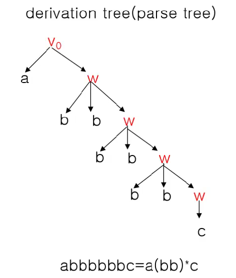

영상: https://www.youtube.com/playlist?list=PLD8rdlfZeJk7aDHa1VxqnX5TyQ4FmgavH

### 형식언어와 문법
#### 언어

- S : 기호들의 집합
- S* : S로부터 만들어지는 모든 유한 문자열들
  - S: 알파벳 S* : 모든 가능한 문장들
  - S = { 정수, +, -, ×, ÷, (, ) } S* : 가능한 모든 수식들(algebraic expressions)
- 다음의 세가지 요소로 구성된다.
  1. `(알파벳)`기호들의 집합 S가 반드시 존재한다.
  2. `(syntax)`S로부터 문장들의 집합 S*를 형성하는 규칙이 반드시 존재한다.
  3. `(semantics)`규칙에 합당하게 만들어진 문장들이 어떤 의미를 갖는지 결정할 수 있어야 한다.

##### Syntax와 Semantics

`(문법)Syntax`: 문장의 적합한 구성에 대한 규정

`(의미론)Semantics`: 문장의 적합한 의미에 대한 규정

> "Going to the store John George to sing" : Syntax: X
>
> "Noiseless blue sounds sit cross-legged under the mountain top." : Syntax: O, Semantics: X
>
> ((3 - 2) ÷ (4 × 7)) ÷ 9 : Syntax: O, Semantics: O
>
> (2 - 3)) + 4 : Syntax: X
>
> 4 - 3 - 2 : Syntax: O, Semantics: O
>
> 2 ÷ 0 : Syntax: O, Semantics: X

#### 형식언어

- `심벌(symbol)` : 기호
- `알파벳(alphabet)` : 기호들의 유한 집합
- `문자열(string)` : 알파벳에 포함된 기호들이 나열된 것
- `공 문자열(empty string)` : 길이가 0인 문자열, λ로 표시(공집합과는 다르다.)

V : 알파벳

V* : V에 속한 기호로 만들어진 문자열의 집합

#### 구-구문 문법(phase-structure grammar)

Phase-structure grammer G=(V,T,S,P)

- V: 기호의 집합
- T: 단말 기호(terminal symbol)
- S: 시작 기호(start symbol, seed)
- P: 생성 규칙(production rule) (⇒로 표시)
  - if w ⇒ w', w is replaced by w' 혹은 w produce w'

> T = { John, Jill, drives, jogs, crelessly, rapidly, frequently }
>
> N = { sentence, noun, verbphrase, verb, adverb }
>
> V = T ∪ N
>
> S = "sentence"
>
> P: 생성 규칙
>
> ​	*<*sentence*>* ⇒  *<*noun*>* *<*verbphrase*>*
>
> ​	*<*noun*>* ⇒ John
>
> ​	*<*noun*>* ⇒ Jill
>
> ​	*<*verbphrase*>* ⇒ *<*verb*>* *<*adverb*>*
>
> ​	*<*verb*>* ⇒ drives
>
> ​	*<*verb*>* ⇒ jogs
>
> ​	*<*adverb*>* ⇒ carelessly
>
> ​	*<*adverb*>* ⇒ rapidly
>
> ​	*<*adverb*>* ⇒ frequently
>
> "Jill drives frequetly."는 문법적으로 맞는 문장인가?
>
> *<*sentence*>* ⇒ <*noun*> *<*verbphrase*>*
>
> ​					 ⇒	  Jill      *<*verb*>* *<*adverb*>*
>
> ​				     ⇒	  Jill	   drives  frequetly

> G = ( V, T, S, P )
>
> N = { S }
>
> T = { a, b }, V = T ∪ N
>
> P = { S ⇒ aSb, S ⇒ ab }
>
> a3b3은 이 문법에서 만들어지는가?
>
> a3b3은 다음과 같이 유도된다.
>
> ​	S ⇒ aSb ⇒ aaSbb ⇒ aaabbb

> G = ( V, T, S, P )
>
> N = { S, A, B }
>
> T = { 0, 1 }, V = T ∪ N
>
> P = { S ⇒ AB0, A ⇒ BB, B ⇒ 01, A ⇒ 1 }
>
> 0101010은 이 문법에서 만들어지는가?
>
> 0101010은 다음과 같이 유도된다.
>
> ​	S ⇒ AB0 ⇒ BBB0 ⇒ 0101010

> V = { v0, w, a, b, c }
>
> N = { v0, w }
>
> T = { a, b, c }
>
> S = v0
>
> P : 생성 규칙
>
> ​	v0 ⇒ aw
>
> ​	w ⇒ bbw
>
> ​	w ⇒ c
>
> abbbbbbc은 이 문법에서 만들어지는가?
>
> 

#### 언어와 문법

> L(G) : 문법 G의 언어
>
> 문법 G를 사용하여 만들어질 수 있는 문장들의 집합

#### 문법의 종류

- 유형0 문법(비제한 문법)
  - 생성에 아무 제약이 없다.
- 유형1 문법(문맥 의존 문법: context sensitive grammar)
  - αAβ ⇒ αΘβ
  - α, β ( N ∪ T )\*, A ∈ N, Θ ∈ ( N ∪ T )\* - { λ }

- 유형2 문법(문맥 자유 문법: context free grammar)
  - A ⇒ α, A ∈ N (비단말 기호), α ∈ ( N ∪ T )\*
- 유형3 문법(정규 문법: regular grammar)
  - A ⇒ aB 혹은 A ⇒ a 혹은  A ⇒ λ , A, B ∈ N, a ∈ T

> G =( V, T, S, P ), N = { A, B }, T = { a, b }
>
> 
>
>
> 예: (유형1)
>
> ​	v0 ⇒ aAB
>
> ​	AB ⇒ bB
>
> ​	B ⇒ b
>
> ​	A ⇒ aB
> 
>
> 예: (유형2)
>
> ​	v0 ⇒ aBa
>
> ​	B ⇒ aBa
>
> ​	B ⇒ b
>
> 
>
> 예: (유형3)
>
> ​	v0 ⇒ aB
>
> ​	B ⇒ bA
>
> ​	B ⇒ b
>
> ​	A ⇒ aB
>
> ​	A ⇒ a

> 유형3(정규) 문법
>
> 언어 { ambn | m, n > 0 }을 생성하는 문법
>
>
> G2 = ( V, T, S, P )
>
> V = { S, A }, T = { a, b },
>
> P = { S ⇒ aS, S ⇒ bA, S ⇒ b, A ⇒ bA, A ⇒ b, A ⇒ λ }
>
> S ⇒ as ⇒ aaS ⇒ aaaS ⇒ aaabA ⇒ aaabb

> 유형2 문법(context free)
>
> 언어 { anbn | n > 0 }을 생성하는 문법
>
>
> G = ( V, T, S, P )
>
> V = { S }, T = { a, b },
>
> P = { S ⇒ aSb, S  ⇒ λ } = { S ⇒ aSb | λ }
>
> S ⇒ aSb ⇒ aaSbb ⇒ aabb

> 유형1 문법(context sensitive)
>
> 언어 { anbncn | n > 0 }을 생성하는 문법
>
>
> G1 = ( V, T, S, P )
>
> V = { S, A, B }, T = { a, b },
>
> P = { S ⇒ aSAB, BA ⇒ AB, aA ⇒ ab, bA ⇒ bb, bB ⇒ bc, cB ⇒ cc, S  ⇒ λ }
>
> S ⇒ aSAB
>
>    ⇒ aaSABAB
>
>    ⇒ aaABAB
>
>    ⇒ aabABB
>
>    ⇒ aabbBB
>
>    ⇒ aabbcB
>
>    ⇒ aabbcc

#### 문법의 표현

- BNF(Backus-Naur Form) 형식
- 문법 다이어그램(syntax diagram)
- 유도 트리(derivation tree)

##### Backus-Naur Form(BNF)

1. 비단말 기호는 `<a>`로 표시한다.
2. 생성 ⇒ dms `::=`로 표시한다.
3. 하나의 비단말 기호로부터 생성되는 여러 개의 문자열은 `|`으로 구분한다.

##### 문법 다이어그램(syntax diagram)

1. 비단말 기호는 사각형으로, 단말 기호는 원으로 그린다.
2. 생성 과정은 화살표로서 표시한다.
3. 하나의 비단말 기호로부터 생성되는 여러 개의 문자열은 병렬로 놓고 화살표로 표시한다.

### 정규식과 정규문법

> | : 기호(symbol)들의 집합(알파벳)
>
> |* :  집합 |의 기호들을 결합하여 만들어지는 유한 크기를 갖는 모든 문자열의 집합
>
> λ : 공 문자열(empty string)
>
> αβ : 문자열 α와 문자열 β의 연결(concatenation)
>
> α+β : 두 문자열 α, β의 합집합 (+는 ∪로도 표시한다)
>
> (α)* : 문자열 α가 유한 개수만큼 반복되어 만들어지는 문자열
>
> ​			λ ∈ (α)\*, (α)\* ≡ α\*
>
>
> 예)
>
> a* = { λ, a, aa, aaa, aaaa, ... }
>
> a(b+c) 혹은 a(b∪c) = { ab, ac }
>
> ab(bc)* = { ab, abbc, abbcbc, abbcbcbc, ... }

#### 정규식(regular expression)

> | : 기호들의 집합(알파벳)
>
> |에서 정의되는 정규식은 다음과 같이 재귀적으로 정의된다.
>
> 1. 공문자열 λ는 정규식이다.
> 2. α ∈ |라면 α는 정규식이다.
> 3. α과 β가 각각 정규식이면 αβ도 정규식이다.
> 4. α과 β가 각각 정규식이면 α+β도 정규식이다.
> 5. α가 정규식이면 α*도 정규식이다.

>  | = { 0, 1 }

1. 다음의 정규식은?

   1. (0 + 1)(0 + 1)*

      0과 1로 이루어진 모든 문자열*

   2. 0(0 + 1)*1

      0으로 시작해서 1로 끝나는 모든 문자열

   3. (01)\*(01 + 1\*) = { 01, 0101, 01011, 01011, ...}

 2. 101로 끝나는 단어들로 이루어진 언어

    (0 + 1)*101

 3.  0 혹은 1로 이루어져 있고 1은 0이 나온 후에 나타나야 하는 언어

    0\*1\*

 4. 최소한 세 개의 연속적인 1을 갖는 단어들

    (0 + 1)\*111(0 + 1)\*

 5. 길이가 3의 배수인 문자열

    ((0 + 1)(0 + 1)(0 + 1))*

#### 정규 집합(regular set)

> | : 기호들의 집합(알파벳)
>
> |* : 정규 집합(regular set)
>
> ​		특정 정규식으로부터 만들어지는 모든 문자열을 정규 집합이라고 한다.

예) | = { a, b, c}, 다음의 정규식으로 만들어지는 정규집합 |* = ?

- a* : |* = { λ, a, aa, aaa, aaaa, ... }
- a(b + c) : |* = { ab, ac }
- ab(bc)* : |* = { ab, abbcbc, ... }

#### 정규식과 정규문법

> 정규 문법은 정규식으로 표현될 수 있으며 
>
> 정규 문법에 의해서 생성되는 언어는
>
> 정규식에 의해서 만들어지는 정규 집합과 동일하다.

> 다음과 같이 BNF로 표시된 생성 규칙은
>
> 정규식 a(bb)*c와 동일하다.
>
> <v0> ::= a\<w\>
>
> \<w\> ::= bb\<w\> | c

> 다음과 같은 문법 다이어그램으로 표시된 생성 규칙은
>
> 정규식 a + b + c*와 동일하다.
>
> 

### 유한상태기계
-

### 오토마타와 언어

오토마타

계산 능력이 있는 추상 기계와 그 기계를 이용해서 풀 수 있는 문제들을 연구하는 분야  
형식 언어를 정의하는 관점에서 컴파일러에서 구분 분석을 하면서 추상 구문 트리를 생성할 때  
계산 능력을 가진 추상 기계를 논하는 관점에서 계산 이론적으로 P-NP문제와도 연관성 있음

### 스트링 매칭 알고리즘
-

### 셈(순열과 조합) - 곱의 법칙과 합의 법칙
-
